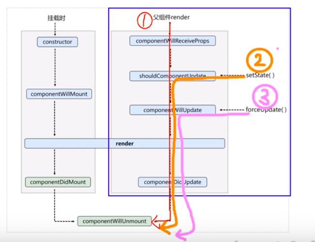

## P37 组件生命周期 - 生命周期回调函数 <=> 生命周期钩子函数

### 1. 挂载 | 卸载

挂载 mount
卸载 unmount

如何卸载组件：

```jsx
ReactDOM.unmountComponentAtNode(document.getElementById('app'))
```

### 2. render()

调用时机：初始化渲染、状态更新之后

###3. componentDidMount()

组件挂载完毕 - 只执行一次

### 4. componentWillUnmount()

组件将要卸载

-----


##P38，39，40，41 生命周期（旧）- 组件挂载流程 | setState 流程 | forceUpdate 流程 | 父组件 render 流程


生命周期钩子什么时候调 跟代码顺序无关

1. constructor
2. componentWillMount
3. render
4. componentDidMount
5. componentWillUnmount （得触发）



蓝色框代表更新部分

###<u>`setState()` 橙色</u>

+ **shouldComponentUpdate**: 组件是否应该被更新 | 有一个默认值为 true **（控制组件更新的阀门）**
+ **componentWillUpdate**: 组件将要更新的钩子
+ **render**
+ **componentDidUpdate**: 组件更新完毕的钩子


### <u>`forceUpdate()`粉色</u>

- **componentWillUpdate**: 组件将要更新的钩子

- **render**

- **componentDidUpdate**: 组件更新完毕的钩子


###<u>父组件 render 流程 红色</u>

父组件 一 render

+ **componentWillReceiveProps**: 组件将要接收props标签属性（第一次不调）
+ **shouldComponentUpdate**
+ **componentWillUpdate**
+ **render**
+ **componentDidUpdate**

----


## 42. 生命周期总结（旧）

### 生命周期3个阶段（旧）

### 1. 初始化阶段 -- 由 ReactDOM.render() 触发 -- 初次渲染

1. constructor
2. componentWillMount
3. render
4. **componentDidMount** 【常用】 -> 初始化的事，开启定时器、发送网络请求、订阅消息

### 2. 更新阶段 -- 由组件内部 this.setState() 或 父组件 render 触发

- shouldComponentUpdate
- componentWillUpdate
- **render** 【必须】 ->
- componentDidUpdate

### 3. 卸载组件 -- 由 ReactDOM.unmountComponentAtNode()触发

+ **componentWillUnmount** 【常用】 -> 收尾的事，关闭定时器、取消订阅消息 

-----


## 43. 对比新旧生命周期函数


**新钩子函数修改的点：**

1. 所有带will的钩子除了 componentWillUnmount 前面都得加上UNSAFE_

   + componentWillMount
   + componentWillReceiveProps
   + componentWillUpdate

   (上述三个生命周期方法即将过时，在新代码中应该避免使用它们)

UNSAFE_ 前缀 不是指安全性。而是表示在未来版本中更有可能出现bug，尤其是在启用异步渲染之后。

<废弃或即将废弃了三个钩子>

2. 增加了两个钩子

+ **getDerivedStateFromProps** 

  是一个类的静态属性 - 若 state 的值在任何时候都取决于 props，可以使用

  必须有返回值：可以使 1. state obj 2. null

  ```js
  static getDerivedStateFromProps(props，state){
  	return props
  }
  //派生状态会导致代码冗余，并使组件难以维护
  ```

+ **getSnapshotBeforeUpdate** - 在更新之前获取快照

  在最近一次渲染输出（提交到 DOM 节点）之前调用。

  可以使组件在发生更改之前从 DOM 中捕获一些信息（例如，滚动位置）

  该生命周期的任何返回值将作为参数 传给 `componentDidUpdate()`

扩展：

componentDidUpdate(preProps, preState,snapshotValue){}

---


##47. 生命周期总结（新）

### 生命周期3个阶段（新）

### 1. 初始化阶段 -- 由 ReactDOM.render() 触发 -- 初次渲染

1. constructor
2. getDerivedStateFromProps
3. render
4. **componentDidMount** 【常用】 -> 初始化的事，开启定时器、发送网络请求、订阅消息

### 2. 更新阶段 -- 由组件内部 this.setState() 或 父组件 render 触发

- getDerivedStateFromProps
- shouldComponentUpdate
- **render** 【必须】 ->
- getSnapshotBeforeUpdate
- componentDidUpdate

### 3. 卸载组件 -- 由 ReactDOM.unmountComponentAtNode()触发

- **componentWillUnmount** 【常用】 -> 收尾的事，关闭定时器、取消订阅消息 