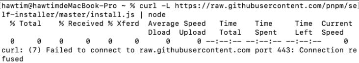
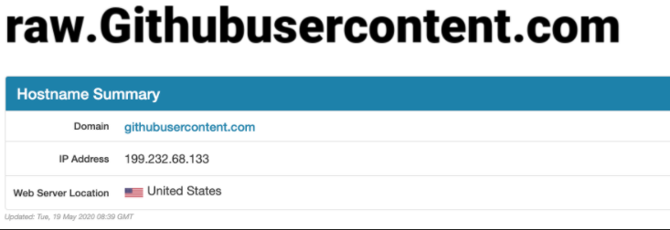
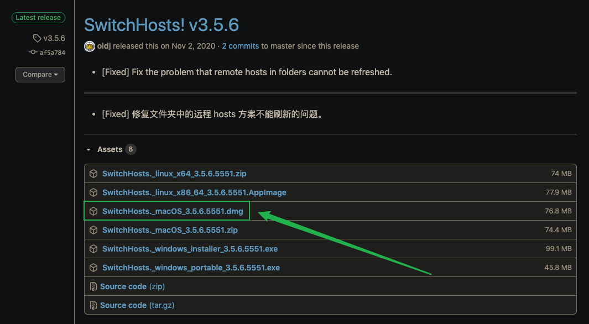
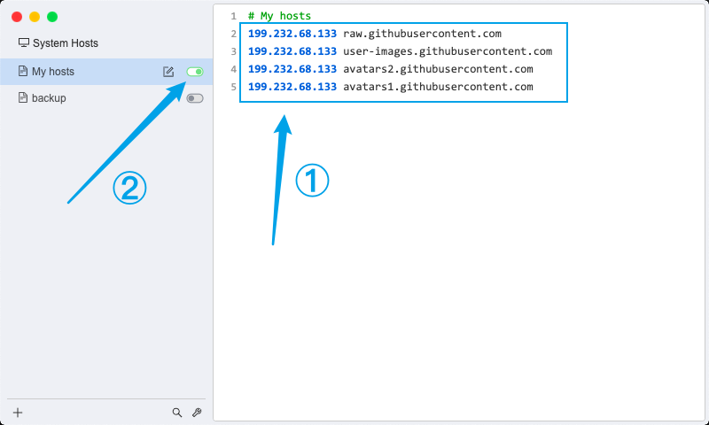

##macOS 安裝 nvm | 教程

nvm 官網：https://github.com/nvm-sh/nvm


### 1. 卸載 node 相關模塊

```zsh
# 查看已经安装在全局的模块
npm ls -g --depth=0
# 删除全局 node_modules 目录
sudo rm -rf /usr/local/lib/node_modules
# 删除 node
sudo rm /usr/local/bin/node 
# 删除全局 node 模块注册的软链
cd /usr/local/bin && ls -l | grep "../lib/node_modules/" | awk '{print $9}'| xargs rm
```


### 2. 安裝 nvm

下載前先確認當前用戶目錄下，是否存在 `.bash_profile`文件，若無則需先創建。

```zsh
# 1.创建 .bash_profile 文件
touch ～/.bash_profile
# 2.运行下载/更新脚本
curl -o- https://raw.githubusercontent.com/nvm-sh/nvm/v0.35.2/install.sh | bash
```


### 3. 下載過程報錯（來自 hawtim - https://github.com/hawtim/blog/issues/10）

**報錯**： curl: (7) Failed to connect to raw.githubusercontent.com port 443: Connection refused



**報錯原因**：

 github 的一些域名 DNS 解析被污染，導致 DNS 解析過程無法通過域名取得正確的 IP 地址 

**解決方案**：

1. 打開  <https://www.ipaddress.com/> 輸入無法訪問的域名



2. 獲得正確的 IP 地址
3. 在本機的 host 文件中添加（可以使用  [switchhosts](https://github.com/oldj/SwitchHosts/releases) ）

199.232.68.133 raw.githubusercontent.com
199.232.68.133 user-images.githubusercontent.com
199.232.68.133 avatars2.githubusercontent.com
199.232.68.133 avatars1.githubusercontent.com

### 3.1 下載 switchhosts

switchhosts 下載地址：  https://github.com/oldj/SwitchHosts/releases

1. 下載最新版本



2. 安裝一下就好 (๑•̀ㅂ•́)و✧ | 配置部分如下：



這樣 nvm 就可以成功安裝了。


### 4. nvm: command not found | 另一個坑

安裝時 macOS 是 Mojave 系統，嘗試了一些網上的方法 比如 在`.bash_profile`, `.zshrc`, or `.profile` 中添加：

```shell
[[ -s $HOME/.nvm/nvm.sh ]] && . $HOME/.nvm/nvm.sh  # This loads NVM
```

依舊 not found..[○･｀Д´･ ○] 

最終查詢到可用的解決 nvm: command not found 方法 如下：

```zsh
# 1.新建一個 .zshrc 文件（若沒有）
touch ~/.zshrc
# 2.在 ~/.zshrc文件最後，增加一行
source ~/.bash_profile
```

來自：掘金5025 的 《macOS 安裝 nvm 踩坑小記》


### 5. 安裝

```shell
# 最新稳定版本
nvm install stable
```


-

補充 另一種安裝 nvm 的方法:

下載 `install.sh` 文件 之後 `sh install.sh`
https://github.com/nvm-sh/nvm/blob/v0.37.2/install.sh


Reference:

+ 掘金5025 *macOS 安裝 nvm 踩坑小記* https://juejin.cn/post/6844904056024989710
  来源：掘金

+ hawtim *如何解决类似 curl: (7) Failed to connect to raw.githubusercontent.com port 443: Connection refused 的问题 #10*
  https://github.com/hawtim/blog/issues/10


