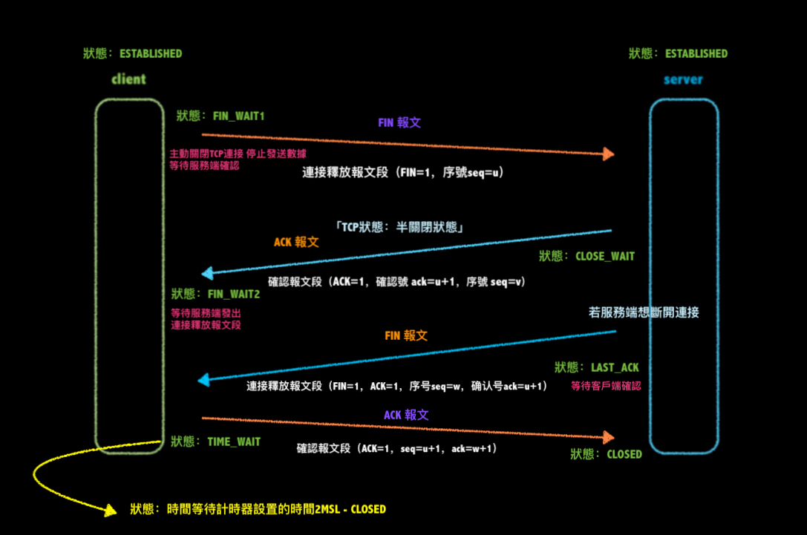

### TCP 三次握手 四次揮手

###☆三次握手（Three-way Handshake）

TCP 是一種面向連接的單播協議，在發送數據前，通信雙方必須在彼此建立一條**連接**。（“連接”是指客戶端和服務端的內存裡保存一份關於對方的信息：ip地址、端口等）

TCP 提供一種可靠、面向連接、字節流、傳輸層的服務，採用 3次握手建立一個連接。採用 4次揮手關閉一個連接。

--

三次握手的目的：

+ **第一次握手**：<u>客戶端</u>**發送**能力、<u>服務端</u>**接收**能力正常
+ **第二次握手**：<u>服務端</u>**接收、發送**能力；<u>客戶端</u>**接收、發送**能力正常（*但此時服務器無法確認客戶端的接收能力是否正常*）
+ **第三次握手**：<u>服務端</u>**接收、發送**能力；<u>客戶端</u>**接收、發送**能力正常 (服務器可以確認)

因此 需要三次握手才能確認雙方的接受與發送能力

注：第三次握手 可以 攜帶數據。（第一「容易讓服務器收到攻擊」、二次是不可以攜帶數據）

---

**ISN(Initial Sequence Number)** - 是動態生成的

ISN 可以看作是一個 32 比特的計數器，每 4ms 加 1 -> 防止在網絡中被延遲的分組在以後又被傳送，而導致某個連接的壹方對它做錯誤的解釋

-----

**SYN 攻擊**：(SYN stands for synchronize 同步)

> **服務器端的資源分配是在二次握手時分配的，而客戶端的資源是在完成三次握手時分配的**，所以服務器容易受到 SYN 洪泛攻擊。SYN攻擊就是Client在短時間內偽造大量不存在的IP地址，並向Server不斷地發送SYN包，Server則回復確認包，並等待Client確認，由於源地址不存在，因此Server需要不斷重發直至超時，這些偽造的SYN包將長時間占用未連接隊列，導致正常的SYN請求因為隊列滿而被丟棄，從而引起網絡擁塞甚至系統癱瘓。SYN 攻擊是壹種典型的 DoS/DDoS 攻擊。(denial-of-service attack 阻斷服務攻擊「阻斷服務(*DoS*) 和分散式阻斷服務 (*DDoS*) 攻擊」)

防禦 SYN 攻擊：

- 縮短超時（SYN Timeout）時間
- 增加最大半連接數
- 過濾網關防護
- SYN cookies技術

----

-----

###☆四次揮手（Four-way handshake）

終止一個連接要經過四次揮手 | 客戶端或服務器均可主動發起揮手動作

這由TCP的**半關閉**（half-close）造成的。所謂的半關閉，其實就是TCP提供了連接的壹端在結束它的發送後還能接收來自另壹端數據的能力。

四次揮手目的:

**ACK報文是用來應答的，SYN報文是用來同步的**

當服務端收到 FIN 報文，不會立即關閉 SOCKET，先回復一個 ACK 報文。等服務端所有報文發完才能發送 FIN 報文。

-

**2MSL（Maximum Segment Lifetime）- 报文段最大生存时间**
它是任何報文在網絡上存在的最長時間，超過這個時間報文將被丟棄

Reference：

+ *“三次握手，四次挥手”你真的懂吗？*Stefno 知乎 https://zhuanlan.zhihu.com/p/53374516
+ *面试官，不要再问我三次握手和四次挥手* 猿人谷 掘金 https://juejin.cn/post/6844903958624878606

