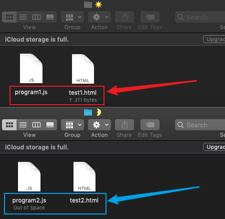
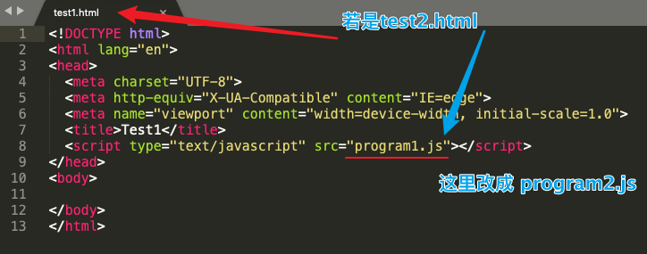
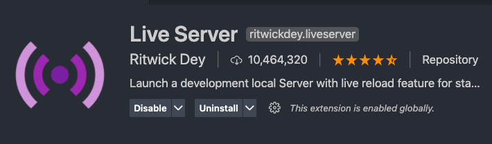
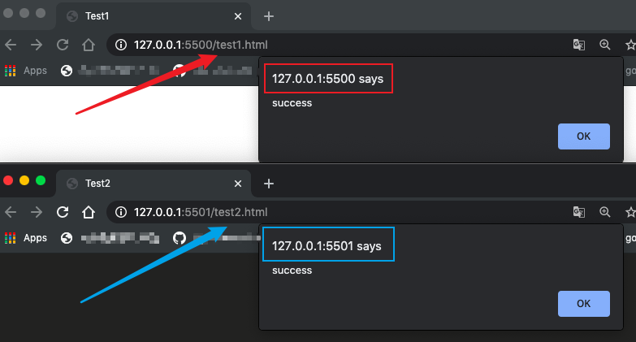
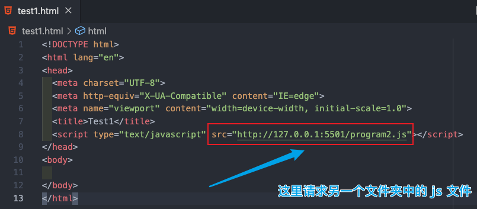
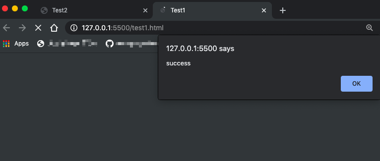
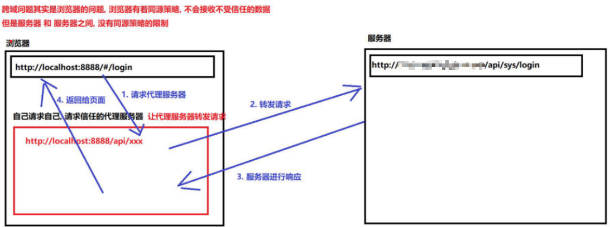
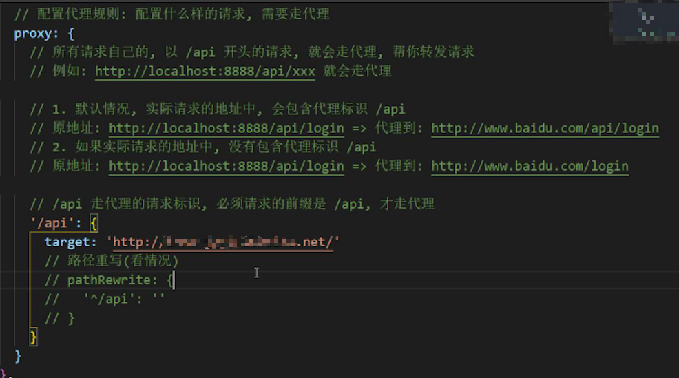

在了解跨域常用解决方法之前，让我们先聊聊，什么是跨域？什么情况下会发生跨域？

想要知道跨域的概念，首先得知道什么是 【同源】以及【同源策略】。

### 1. 同源：

概念：指的是页面若协议、域名、端口 都相同，那么两个页面就有相同的源。

###2. 同源策略：

概念：同源策略是浏览器的一个安全限制，从一个源加载的文档或脚本默认不能访问另一个源的资源。
目的：为了保证用户信息安全，防止恶意网站窃取数据。

（小知识点：如果省略端口，则默认端口号为 80）

### 3. 跨域：

跨域的含义很简单，如果协议、域名、端口有其一不相同，非同源，也称之为跨域。

---

比较常见的跨域解决方法如下：

### 1. JSONP

JSONP 是 JSON with Padding 的简写。

实现原理：利用 script 标签的 src 属性不受同源策略限制，向服务端请求同时传一个 callback 回调方法名作为参数，服务端接受函数名生成返回 json 格式资源的代码。

-

【不受同源策略限制】是不是很空洞？没关系，让我们来看一个小栗子~

1. 首先创建俩文件夹


2. 分别在里面创建 test.js 和 test.html（这里我们为了好区分，一个 test1, 一个test2）

   

3. 在 program1.js 和 program2.js 中简单写上一个弹出消息：

   `alert('success')`

4. 在 test1.html 和 test2.html 中 创建一个 html 基本架构，另引入 script 文件：

   

5. 让我们打开 2 个不同的 VSCode，在 localhost 上预览一下吧(๑•̀ㅂ•́)و✧

   （这里如果没有装 liveServer VSCode 插件 可以赶紧装一下哦~前端必备插件呢~）

   

6. 预览效果如下：

   

7. 两个都正常显示弹出框，好了 聪明的你有没有发现，其实这两个页面是非同源的（因为端口不一样，一个 5000，一个 5001）

   能猜到后面做什么嘛~ 是der！让我们把 test1.html script 的 src 引用链接稍稍修改一下叭~

   

8. 再让我们打开一下 test1.html，看看还有没有 弹出框吧。

   

9. 再读读开篇写的那句话【script 不受同源策略限制】 ，这回理解了吧~

-

（小知识点：这些标签都不受同源策略的限制哦~：``、`<link>`、`<iframe>`等）

-

JSONP 实现模型：

**创建一个回调函数，然后在远程服务上调用这个函数并将 JSON 数据形式作为参数传递，完成回调。**

```html
<!-- test1.html -->
<script type="text/javascript">
    function callback(data) {
        alert(data.message);
    }
  </script>
  <script type="text/javascript" src="http://127.0.0.1:5501/program2.js"></script>
```

```js
//program2.js
callback({message:'succ'})
```

---> 新问题：这个 callback 函数名是我们自己定义的，如何让远程 js 知道它所调用的本地函数名呢？

解决方法：动态生成服务端所提供的 js 脚本，这样调用者可以传一个参数告诉服务端，服务器就可以按照客户端的需求来生成 js 脚本并响应

```html
<!-- test1.html -->
<script type="text/javascript">
function concertHandler(data) {
    alert('最近鱼丁糸的演唱会信息为: 日期：' + data.date + '票价：' + data.price);
}
//添加<script>标签的方法
function addScriptTag(src){
	var script = document.createElement('script');
    script.setAttribute("type","text/javascript");
    script.src = src;
    document.body.appendChild(script);
}

window.onload = function(){
  addScriptTag("http://jsonp.com/jsonp/concertTicketInfo.aspx?code=sodagreen&callback=concertHandler");
}
</script>
<!-- concertTicketInfo.aspx 生成以下代码 -->
concertHandler({
  "band": "sodagreen",
  "price": 'xxx',
  "date": 'xxx'
});
```


**优点：**兼容性好，实现比较简单
**缺点：**只能发送 get 请求，响应失败没有状态码， 数据容易被劫持

###2. CORS 

CORS 是 Cross-Origin Resources Sharing 的简写，跨域资源共享，是W3C的标准。

目前基本主流浏览器都支持 CORS，所以只要后端支持 CORS 就能够实现跨域。服务端设置 Access-Control-Allow-Origin。若设置通配符 * 则表示所有网站都可访问资源。


###3. 反向代理

服务器和服务器之间，没有同源策略的限制

1. 代理服务器

   - 正向代理（VPN, 翻墙）

   - 反向代理（转发资源、解决跨域）

     一切配置的都是 反向代理（nginx, node, webpack 配置的代理）

2. 原理

   

代理服务器的配置 两种情况：

1. **开发时的跨域**（必然会遇到），现在前后端分离

   解决方案：cors，配置开发时的代理服务器

   （前端代码运行在 webpack 服务器的，配置的就是 webpack 代理服务）

2. **上线时的跨域**（可能会遇到）

   解决方案：cors，配置上线时的代理服务器

   （前端代码部署在 nginx 服务器，node 服务器上，配置的就是 nginx 或 node 服务器代理）




Reference：

1. 简书：《JSONP跨域详解》by 公子七 https://www.jianshu.com/p/e1e2920dac95
2. cnblogs:《彻底弄懂jsonp原理及实现方法》by xiaobe https://www.cnblogs.com/soyxiaobi/p/9616011.html


